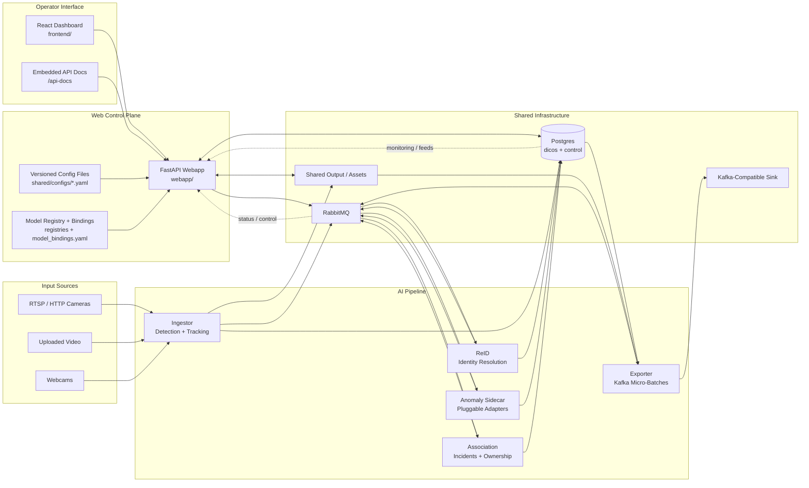
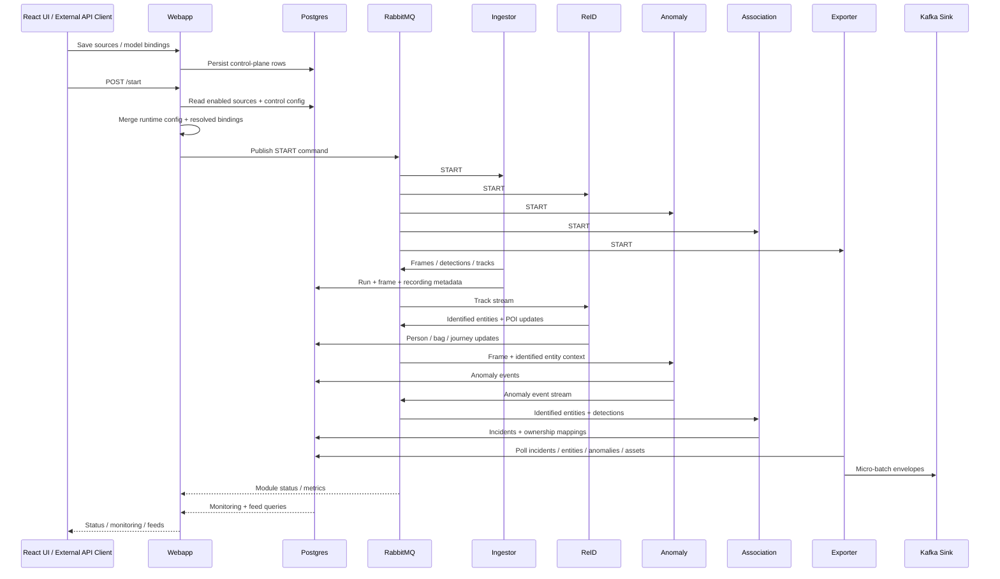

# DHS Backend Architecture Notes

This document updates the original 2023 "DHS Backend (Proto-SAIB)" write-up using the
current repository layout. The PDF remains useful historical context, but several names and
capabilities in that document no longer map 1:1 to this checkout.

## Scope

- Repository: `dhs-passenger-detection`
- Current top-level runtime modules:
  - `ingestor`
  - `reid`
  - `association`
  - `anomaly`
  - `exporter`
  - `webapp`
  - `rabbitmq`
  - `db`
- Historical or optional items referenced by older documentation:
  - clothing segmentation / fashion
  - FOIA services
  - older entrypoint names such as `Ingestor/orchestrator.py`

## Runtime Topology

The backend is structured as separate long-running services coordinated through Docker
Compose.

## Architecture Diagram Notes

- `webapp` is both the operator-facing control plane and the API surface for external systems.
- Source definitions, uploaded media, resource telemetry, model registrations, model bindings,
  and export sink registrations all persist under the Postgres `control` schema.
- Runtime entities such as runs, incidents, entities, journey nodes, recordings, frames, and
  anomaly events persist under `dicos`.
- Model registration is config-backed, then mirrored into Postgres for API/UI visibility.
- `ingestor`, `reid`, `anomaly`, and `association` communicate primarily through RabbitMQ.
- `exporter` is intentionally DB-backed so it emits normalized persisted outputs instead of
  scraping API responses.

## Runtime Flow

## Service Responsibilities

### `ingestor`

Entry point: `ingestor/main.py`

Current responsibilities:

- Open configured camera streams or video files.
- Generate frames through `MultiCapture` and `FramesThread`.
- Run detector/tracker inference through `Detector`.
- Enrich frame objects with detections and tracker inputs.
- Push frame bundles into `ingestor/output_threads.py` for downstream publication.
- Publish run metadata and module status messages.

This still matches the broad role described in the PDF: ingestor is the pipeline front door and
the place where raw video becomes structured track/detection data.

### `reid`

Entry point: `reid/main.py`

Current responsibilities:

- Consume track messages from RabbitMQ.
- Run separate ReID flows for people and bags.
- Assign temporary or persistent IDs.
- Track temp-to-real ID updates and ID guesses.
- Publish enriched track information to downstream consumers.
- Manage POI search updates through `reid/poi.py`.

The high-level concept from the PDF still holds: ReID converts camera-local tracks into
cross-camera identities. The current implementation is centered on `TrackCentroids` for people
and `StationaryKNN` for bags.

### `association`

Entry point: `association/main.py`

Current responsibilities:

- Consume entity and detection messages from RabbitMQ.
- Maintain person, bag, and gun manager state.
- Produce owner relationships such as bag-to-person mappings.
- Create incidents such as unattended bag and gun-related events.
- Consume manual or external incident resolutions.
- Send normalized outputs to the database/web layer.

Compared with the PDF, the current association module is broader than tray/bag ownership
alone. It now also handles gun detections and incident resolution flow.

### `anomaly`

Entry point: `anomaly/main.py`

Current responsibilities:

- Consume normalized frame and ReID context after entity resolution.
- Resolve the configured anomaly adapter per source or run default.
- Emit normalized anomaly events with model metadata and asset references.
- Persist anomaly events and republish them for downstream consumers.

This module is intentionally adapter-driven. The built-in heuristic adapter works today, and
the external VLM demo integration point is represented as an optional adapter boundary rather
than a hard-coded dependency.

### `exporter`

Entry point: `exporter/main.py`

Current responsibilities:

- Read persisted incidents, entities, anomaly events, and asset references from Postgres.
- Build Kafka-compatible micro-batch envelopes on configurable thresholds.
- Publish structured event batches without inlining large media bytes.
- Report exporter health, backlog, and last-flush state back into the control plane.

This is a persistence-backed export path, not a frontend feed scraper. That keeps downstream
delivery coupled to normalized stored outputs instead of UI-oriented API shapes.

### `webapp`

Entry points:

- API app: `webapp/main.py`
- runner: `webapp/run.py`
- frontend: `frontend/`

Current responsibilities:

- Serve REST endpoints for run control, mixed-source configuration, upload staging, status,
  resource telemetry, POI registration, and Genetec-style views.
- Read/write incident and entity data from Postgres.
- Persist operator-managed control-plane data under the Postgres `control` schema.
- Push start/stop and POI messages into RabbitMQ.
- Host the React dashboard during local Docker-based development.

Notable route groups:

- `/start`, `/stop`, `/status`
- `/sources`, `/sources/uploads`, `/system/resources`
- `/system/modules/{module_name}/restart`
- `/camera_stream`, `/camera_streams` (compatibility endpoints)
- `/register_poi`
- `/genetec/runs`
- `/genetec/incidents`, `/genetec/incident`
- `/genetec/entities`, `/genetec/entity`
- `/genetec/update_incident`
- `/genetec/incident_video/`
- `/genetec/pois`, `/genetec/poi`

### Infrastructure

#### `rabbitmq`

- Message broker used for inter-module communication.
- Required by `webapp`, `ingestor`, `reid`, and `association`.

#### `db`

- Single PostgreSQL store on `db:5432` for both runtime and control-plane data.
- Schema models live in `shared/models/SQLModels.py`.

Current schemas:

- `dicos`: runs, incidents, entities, journey nodes, recordings, POI data
- `control`: source templates, uploaded media metadata, resource snapshots, resource events

## Shared Code

The `shared/` directory is the main contract surface between services. It contains:

- database helpers
- SQL/API/data models
- RabbitMQ publishers/consumers
- constants and config helpers
- utility modules used across services
- mounted config and output directories used by containers

This matches the original PDF’s description of `shared` as the cross-container dependency hub.

## Current Versus Historical Documentation

The attached PDF is still valuable for concepts and intent, especially for:

- the end-to-end message flow
- the idea of zone-aware ReID
- bag ownership and abandonment logic
- the role of a shared volume for configs and outputs

However, treat the following items as historical unless you confirm them in code:

- clothing segmentation / fashion service
- tray-specific ArUco flow
- older container and entrypoint names
- dashboard usage instructions that assume a static HTML frontend

## Operational Notes

- `ingestor` and `reid` are configured with `runtime: nvidia` in `docker-compose.yaml`.
- `shared/configs/config.yaml` is expected at runtime and is normally created locally from
  `shared/configs/example_config.yaml`.
- Camera and video source ownership has moved out of `config.yaml`; operators manage those rows in
  the web UI and the API persists them in Postgres before a run starts.
- FOIA services are now behind an explicit `foia` compose profile and should be treated as
  optional unless that profile is enabled and the supporting files are present.
- The frontend is served from the `webapp` container and expects the API on port `8000`.

## Testing Boundaries

This repository mixes pure utility code with GPU, CV, RabbitMQ, and database-heavy services.
That means there are two realistic layers of verification:

1. Lightweight unit tests for pure shared logic.
2. Docker-based system validation for module orchestration and message flow.

The unit tests added in `tests/test_shared_utils.py` intentionally cover the first layer only.
